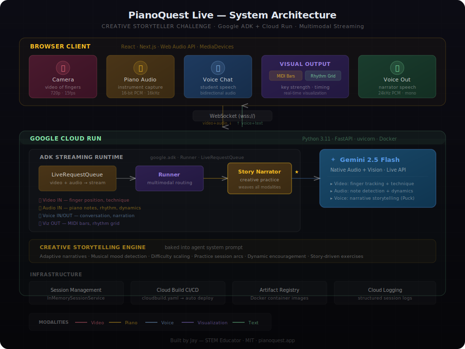

# PianoQuest Live

**Real-time AI piano coaching through creative storytelling.**

Your piano playing drives a living story. The AI sees your hands, hears your playing, and speaks to you in real time — turning practice into an interactive quest with visual feedback.

Built for the [Gemini Live Agent Challenge](https://geminiliveagentchallenge.devpost.com/) — **Creative Storyteller** category.

**Live Demo:** https://pianoquest-live-tydxja77iq-uc.a.run.app



---

## What It Does

PianoQuest Live is a multimodal AI piano coach that combines **3 input streams** with **8 interleaved output modalities**:

### Inputs
| Modality | Source | What It Captures |
|----------|--------|-----------------|
| **Vision** | Camera | Finger position, hand shape, technique |
| **Audio** | Microphone | Piano notes, dynamics, rhythm, voice |
| **Voice** | Microphone | User goals, questions, reactions |

### Outputs (Interleaved Multimodal)
| Modality | Type | Description |
|----------|------|-------------|
| **Voice Narration** | Audio | Real-time coaching wrapped in storytelling |
| **Story Scenes** | Visual | 8 themed scene cards that transition with the narrative |
| **MIDI Dynamic Bars** | Visual | 36-band frequency analysis mapped to piano range |
| **Rhythm Accuracy Grid** | Visual | Onset detection vs. BPM grid with color-coded timing |
| **Technique Score** | Data | Real-time 0-100 score (dynamics evenness + rhythm accuracy) |
| **Coaching Focus** | Text | Current coaching instruction parsed from narration |
| **Achievement Badges** | Visual | Animated popups for milestones (Resonant Triad, Steady Pulse, etc.) |
| **Quest Journey Map** | Visual | 5-phase narrative arc: Opening → Assessment → Challenge → Mastery → Celebration |

### The Demo Arc

**Bad playing → Coaching → Visible improvement**

1. User plays a C major triad with uneven dynamics
2. Agent sees fingers via camera, hears the imbalance, names it "Chapter 1: The Harmony Garden"
3. Agent coaches: "Your 4th finger on the E is landing flat — try leading with the fingertip"
4. User improves — technique score rises from ~40 to ~85, scene transitions to "Sunrise Peak"
5. Agent awards "Resonant Triad" achievement, quest map advances to Mastery

---

## Tech Stack

| Component | Technology |
|-----------|-----------|
| **AI Model** | Gemini 2.5 Flash (native audio + vision) via Live API |
| **Framework** | Google ADK (Agent Development Kit) v1.26+ |
| **Backend** | Python, FastAPI, WebSocket streaming |
| **Frontend** | HTML/JS, Web Audio API, Canvas |
| **Deployment** | Google Cloud Run, Cloud Build |
| **Voice** | Puck (prebuilt voice) |

---

## Quick Start

### Prerequisites
- Python 3.11+
- Google Cloud API key with Gemini access

### Local Development

```bash
# Clone and install
git clone https://github.com/jayismocking/pianoquest-live.git
cd pianoquest-live
pip install -r requirements.txt

# Set your API key
echo "GOOGLE_API_KEY=your-key-here" > .env

# Run
python -m agent
```

Open http://localhost:8080 — allow camera and microphone access.

### Deploy to Cloud Run

```bash
# Set your GCP project
gcloud config set project YOUR_PROJECT_ID

# Create Artifact Registry repo (one-time)
gcloud artifacts repositories create pianoquest-live \
  --repository-format=docker --location=us-central1

# Deploy
bash deploy/deploy.sh
```

Or use Cloud Build directly:

```bash
gcloud builds submit --config=cloudbuild.yaml \
  --substitutions=_API_KEY=your-key-here
```

---

## Project Structure

```
pianoquest-live/
├── agent/
│   ├── agent.py        # ADK agent with storyteller prompt
│   ├── server.py       # FastAPI + WebSocket server
│   └── __main__.py     # Entry point
├── static/
│   └── index.html      # Full frontend (camera, viz, UI)
├── deploy/
│   └── deploy.sh       # Cloud Run deploy script
├── docs/
│   ├── architecture.svg    # System architecture diagram
│   └── demo-script.md     # Demo video script
├── cloudbuild.yaml     # Cloud Build CI/CD
├── Dockerfile          # Container config
└── requirements.txt    # Python dependencies
```

---

## How It Works

1. **Browser** captures camera video + microphone audio
2. **WebSocket** streams audio (16kHz PCM) and video frames (JPEG every 2s) to server
3. **ADK Runner** routes streams through `LiveRequestQueue` to Gemini Live API
4. **Gemini 2.5 Flash** processes vision + audio + voice simultaneously, generates coaching narration
5. **Voice response** (24kHz PCM) streams back to browser for gapless playback
6. **Transcript** is parsed client-side for scene transitions, achievements, and coaching tips
7. **Web Audio API** analyzes microphone input locally for MIDI bars and rhythm grid

All processing happens in real-time with no turn-taking — the agent responds during natural pauses in playing.

---

## Competition Details

- **Challenge:** [Gemini Live Agent Challenge](https://geminiliveagentchallenge.devpost.com/)
- **Category:** Creative Storyteller
- **GCP Project:** jworks-interpreter-challenge
- **Cloud Run:** pianoquest-live (us-central1)

### Judging Criteria
| Criterion | Weight | How We Address It |
|-----------|--------|-------------------|
| Innovation & Multimodal UX | 40% | 3 inputs × 8 outputs, bidirectional multimodal streaming |
| Technical Implementation | 30% | ADK + Live API + Cloud Run, real-time WebSocket streaming |
| Demo & Presentation | 30% | Clear arc: bad playing → coaching → visible improvement |

---

Built by Jay — MIT · STEM Educator · [pianoquest.app](https://pianoquest.app)
